# Top-K Leaderboard System Design - Scaling from 0 to Millions

## Table of Contents
1. [Overview](#overview)
2. [Scaling Journey: 0 to Millions](#scaling-journey-0-to-millions)
3. [Functional Requirements](#functional-requirements)
4. [Non-Functional Requirements](#non-functional-requirements)
5. [Capacity Estimation](#capacity-estimation)
6. [System Architecture](#system-architecture)
7. [Data Flow Architecture](#data-flow-architecture)
8. [Detailed Processing Architecture](#detailed-processing-architecture)
9. [Database Schema](#database-schema)
10. [Caching Strategy](#caching-strategy)
11. [Count-Min Sketch Deep Dive](#count-min-sketch-deep-dive)
12. [Query Processing Flow](#query-processing-flow)
13. [Fault Tolerance & Recovery](#fault-tolerance--recovery)
14. [Production-Level Considerations](#production-level-considerations)
15. [Advanced Algorithms & Optimizations](#advanced-algorithms--optimizations)
16. [Data Lifecycle & Storage Tiers](#data-lifecycle--storage-tiers)

## Overview

A Top-K Leaderboard system that efficiently tracks and displays the most frequent events in real-time, scaling from a simple MVP to handling millions of events per second. This design focuses on the architectural evolution and decision-making process behind each technology choice.

## Scaling Journey: 0 to Millions

### Phase 1: MVP (0-1K users)
**Architecture:** Client → API → Database → Response

**Why this approach:**
- **Simplicity**: Single database handles everything
- **Cost-effective**: Minimal infrastructure
- **Fast development**: Quick to market

**Technology choices:**
- **PostgreSQL**: ACID compliance, SQL familiarity
- **Redis**: Simple caching for performance
- **Node.js/Python**: Rapid development

**Limitations:**
- Single point of failure
- Vertical scaling only
- No real-time processing

### Phase 2: Growth (1K-100K users)
**Architecture:** Client → Load Balancer → API → Cache → Database

**Why we need to evolve:**
- **Performance**: Database becomes bottleneck
- **Reliability**: Need redundancy
- **Scalability**: Horizontal scaling required

**Technology additions:**
- **Load Balancer**: Distribute traffic
- **Read Replicas**: Scale read operations
- **Connection Pooling**: Manage database connections
- **CDN**: Cache static content globally

**Decision rationale:**
- **Load Balancer**: Nginx chosen for simplicity and performance
- **Read Replicas**: PostgreSQL streaming replication
- **Connection Pooling**: PgBouncer for connection management

### Phase 3: Scale (100K-1M users)
**Architecture:** Client → CDN → Load Balancer → API Gateway → Microservices → Message Queue → Processing → Storage

**Why we need streaming:**
- **Real-time requirements**: Users expect instant updates
- **Volume**: Database can't handle write load
- **Complexity**: Need event-driven architecture

**Technology evolution:**
- **Apache Kafka**: Event streaming platform
- **Apache Spark Streaming**: Real-time processing
- **Microservices**: Service decomposition
- **API Gateway**: Request routing and management

**Why Kafka over alternatives:**
- **Durability**: Messages persisted to disk
- **Scalability**: Horizontal partitioning
- **Fault tolerance**: Replication across brokers
- **Performance**: High throughput, low latency

**Why Spark Streaming over alternatives:**
- **Micro-batch processing**: Balances latency and throughput
- **Fault tolerance**: Automatic recovery from failures
- **Scalability**: Dynamic resource allocation
- **Integration**: Works well with Kafka

### Phase 4: Enterprise (1M+ users)
**Architecture:** Multi-region, event-driven, microservices with advanced data processing

**Why we need advanced processing:**
- **Memory constraints**: Can't store all data in memory
- **Accuracy vs Performance**: Need approximate algorithms
- **Time-series data**: Historical analysis requirements

**Advanced technologies:**
- **Count-Min Sketch**: Probabilistic data structure
- **Time Series Database**: Optimized for time-based queries
- **HDFS**: Distributed storage for historical data
- **Multi-region deployment**: Global availability

## Functional Requirements

### Core Features
1. **Real-time Event Tracking**
   - Track events as they occur
   - Support multiple event types
   - Handle high-frequency events

2. **Top-K Leaderboard Generation**
   - Calculate top-K most frequent events
   - Support different time windows (1min, 5min, 1hour, 1day)
   - Handle multiple K values (10, 50, 100)

3. **Query Interface**
   - RESTful API for leaderboard queries
   - Support filtering by event type and time range
   - Real-time and historical queries

4. **Admin Interface**
   - Configure event types and schemas
   - Monitor system health
   - Manage data retention policies

### Advanced Features
1. **Multi-tenancy Support**
   - Isolate data by tenant
   - Tenant-specific configurations
   - Usage analytics per tenant

2. **Event Schema Management**
   - Dynamic schema evolution
   - Schema validation
   - Backward compatibility

3. **Alerting System**
   - Threshold-based alerts
   - Anomaly detection
   - Real-time notifications

## Non-Functional Requirements

### Performance
- **Latency**: < 100ms for real-time queries
- **Throughput**: 1M+ events/second
- **Availability**: 99.99% uptime
- **Scalability**: Linear scaling with load

### Reliability
- **Fault Tolerance**: System continues operating with component failures
- **Data Consistency**: Eventual consistency acceptable
- **Recovery Time**: < 5 minutes for service recovery

### Security
- **Authentication**: OAuth 2.0 / JWT tokens
- **Authorization**: Role-based access control
- **Data Encryption**: TLS in transit, AES-256 at rest
- **Audit Logging**: Complete audit trail

### Maintainability
- **Monitoring**: Comprehensive metrics and logging
- **Deployment**: Blue-green deployments
- **Documentation**: API documentation and runbooks

## Capacity Estimation

### Event Volume Analysis
**Assumptions:**
- 1M active users
- 10 events per user per minute
- Peak traffic: 3x average
- Event size: 1KB average

**Calculations:**
- Average events/second: (1M users × 10 events/min) / 60 = 166,667 events/sec
- Peak events/second: 166,667 × 3 = 500,000 events/sec
- Daily event volume: 500,000 × 86,400 = 43.2 billion events/day
- Daily data volume: 43.2B × 1KB = 43.2TB/day

### Storage Requirements
**Raw Event Storage:**
- Daily: 43.2TB
- Monthly: 43.2TB × 30 = 1.3PB
- Annual: 1.3PB × 12 = 15.6PB

**Processed Data Storage:**
- Leaderboard snapshots: 1GB/day
- Time-series data: 100GB/day
- Metadata: 10MB/day

### Network Requirements
**Ingress Traffic:**
- Peak: 500,000 events/sec × 1KB = 500MB/sec = 4Gbps
- Average: 166,667 events/sec × 1KB = 166MB/sec = 1.3Gbps

**Egress Traffic:**
- API responses: 10% of ingress = 400Mbps peak
- Inter-service communication: 20% of ingress = 800Mbps peak

### Compute Requirements
**Processing Power:**
- Spark Streaming: 100 CPU cores
- Kafka brokers: 20 CPU cores
- API servers: 50 CPU cores
- Database servers: 30 CPU cores

**Memory Requirements:**
- Spark executors: 500GB total
- Kafka brokers: 200GB total
- Redis cache: 100GB total
- Database buffers: 50GB total

## System Architecture

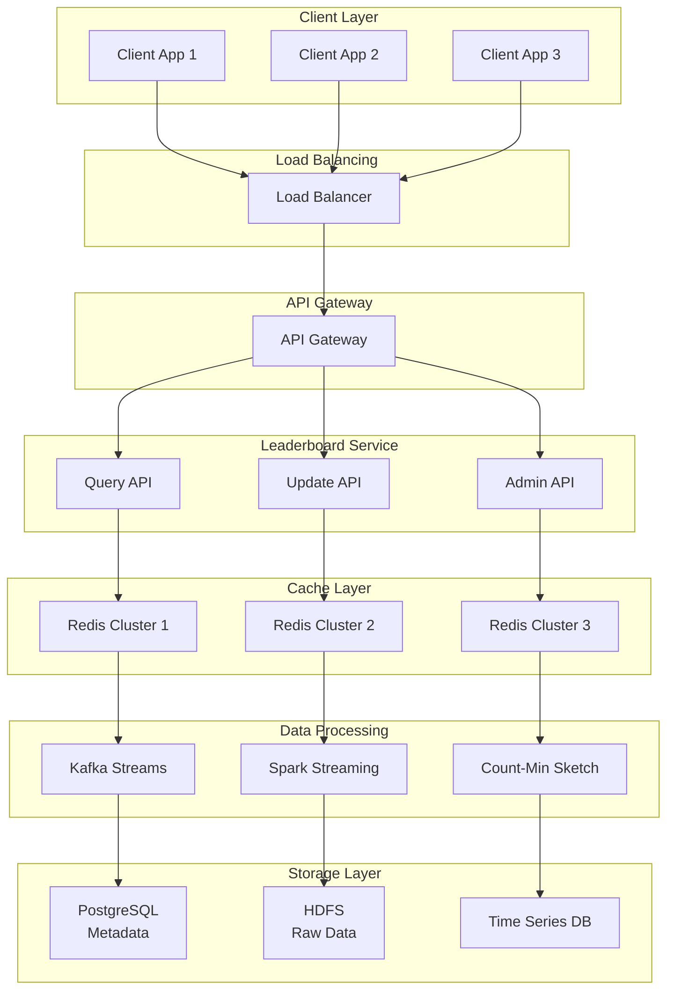
```mermaid
graph TB
    subgraph "Client Layer"
        C1[Client App 1]
        C2[Client App 2]
        C3[Client App 3]
    end
    
    subgraph "Load Balancing"
        LB[Load Balancer]
    end
    
    subgraph "API Gateway"
        AG[API Gateway]
    end
    
    subgraph "Leaderboard Service"
        QA[Query API]
        UA[Update API]
        AA[Admin API]
    end
    
    subgraph "Cache Layer"
        R1[Redis Cluster 1]
        R2[Redis Cluster 2]
        R3[Redis Cluster 3]
    end
    
    subgraph "Data Processing"
        KS[Kafka Streams]
        SS[Spark Streaming]
        CMS[Count-Min Sketch]
    end
    
    subgraph "Storage Layer"
        PG[PostgreSQL<br/>Metadata]
        HDFS[HDFS<br/>Raw Data]
        TS[Time Series DB]
    end
    
    C1 --> LB
    C2 --> LB
    C3 --> LB
    LB --> AG
    AG --> QA
    AG --> UA
    AG --> AA
    QA --> R1
    UA --> R2
    AA --> R3
    R1 --> KS
    R2 --> SS
    R3 --> CMS
    KS --> PG
    SS --> HDFS
    CMS --> TS
```

## Data Flow Architecture

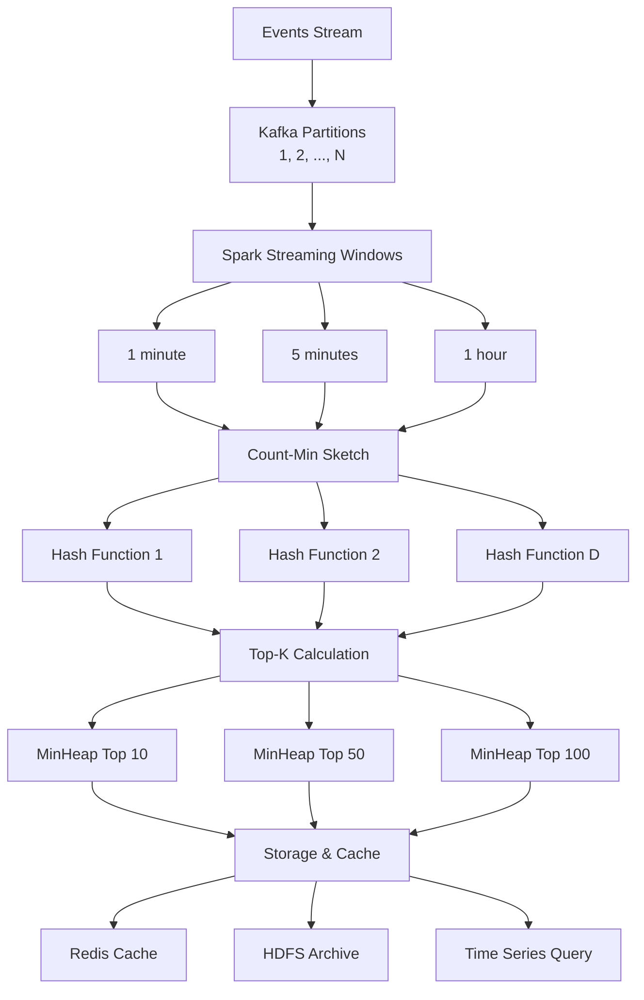
```mermaid
graph TD
    ES[Events Stream] --> KP[Kafka Partitions<br/>1, 2, ..., N]
    
    KP --> SSW[Spark Streaming Windows]
    SSW --> W1[1 minute]
    SSW --> W5[5 minutes]
    SSW --> WH[1 hour]
    
    W1 --> CMS[Count-Min Sketch]
    W5 --> CMS
    WH --> CMS
    
    CMS --> HF1[Hash Function 1]
    CMS --> HF2[Hash Function 2]
    CMS --> HFD[Hash Function D]
    
    HF1 --> TK[Top-K Calculation]
    HF2 --> TK
    HFD --> TK
    
    TK --> MH10[MinHeap Top 10]
    TK --> MH50[MinHeap Top 50]
    TK --> MH100[MinHeap Top 100]
    
    MH10 --> SC[Storage & Cache]
    MH50 --> SC
    MH100 --> SC
    
    SC --> REDIS[Redis Cache]
    SC --> HDFS[HDFS Archive]
    SC --> TS[Time Series Query]
```

## Detailed Processing Architecture

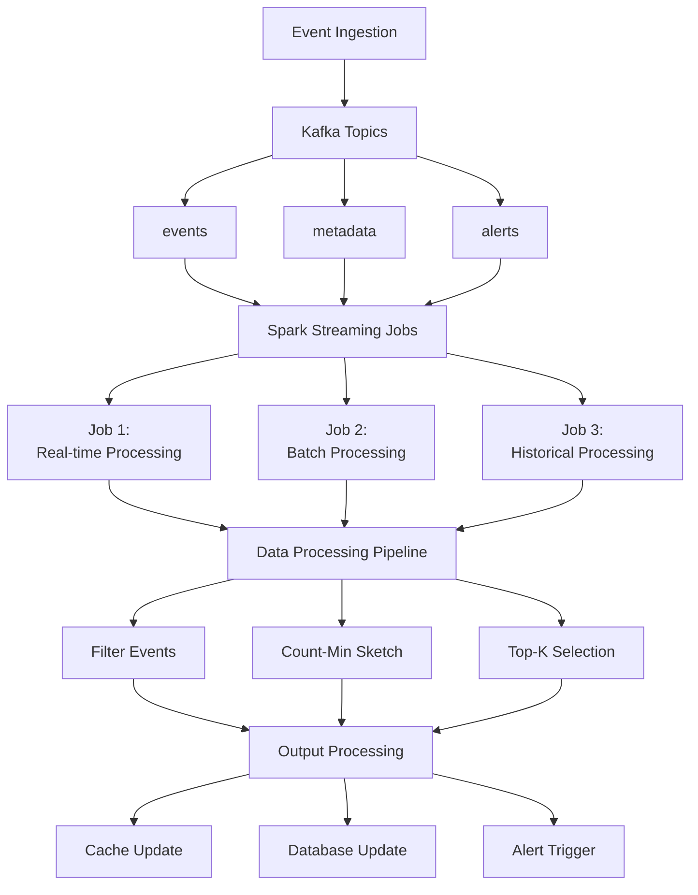
```mermaid
graph TD
    EI[Event Ingestion] --> KT[Kafka Topics]
    
    KT --> ET[events]
    KT --> MT[metadata]
    KT --> AT[alerts]
    
    ET --> SSJ[Spark Streaming Jobs]
    MT --> SSJ
    AT --> SSJ
    
    SSJ --> J1[Job 1:<br/>Real-time Processing]
    SSJ --> J2[Job 2:<br/>Batch Processing]
    SSJ --> J3[Job 3:<br/>Historical Processing]
    
    J1 --> DPP[Data Processing Pipeline]
    J2 --> DPP
    J3 --> DPP
    
    DPP --> FE[Filter Events]
    DPP --> CMS[Count-Min Sketch]
    DPP --> TKS[Top-K Selection]
    
    FE --> OP[Output Processing]
    CMS --> OP
    TKS --> OP
    
    OP --> CU[Cache Update]
    OP --> DU[Database Update]
    OP --> AT2[Alert Trigger]
```

## Database Schema

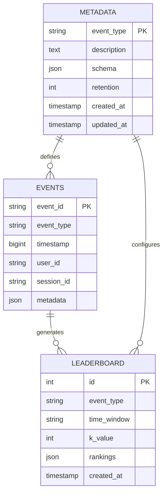
```mermaid
erDiagram
    EVENTS {
        string event_id PK
        string event_type
        bigint timestamp
        string user_id
        string session_id
        json metadata
    }
    
    LEADERBOARD {
        int id PK
        string event_type
        string time_window
        int k_value
        json rankings
        timestamp created_at
    }
    
    METADATA {
        string event_type PK
        text description
        json schema
        int retention
        timestamp created_at
        timestamp updated_at
    }
    
    EVENTS ||--o{ LEADERBOARD : "generates"
    METADATA ||--o{ EVENTS : "defines"
    METADATA ||--o{ LEADERBOARD : "configures"
```

### Schema Details

#### Events Table
```sql
CREATE TABLE events (
    event_id VARCHAR(36) PRIMARY KEY,
    event_type VARCHAR(50) NOT NULL,
    timestamp BIGINT NOT NULL,
    user_id VARCHAR(50),
    session_id VARCHAR(50),
    metadata JSONB,
    created_at TIMESTAMP DEFAULT NOW()
);

-- Indexes
CREATE INDEX idx_events_type_timestamp ON events(event_type, timestamp);
CREATE INDEX idx_events_user_id ON events(user_id);
CREATE INDEX idx_events_session_id ON events(session_id);
CREATE INDEX idx_events_created_at ON events(created_at);
```

#### Leaderboard Table
```sql
CREATE TABLE leaderboard (
    id SERIAL PRIMARY KEY,
    event_type VARCHAR(50) NOT NULL,
    time_window VARCHAR(20) NOT NULL,
    k_value INTEGER NOT NULL,
    rankings JSONB NOT NULL,
    created_at TIMESTAMP DEFAULT NOW()
);

-- Indexes
CREATE INDEX idx_leaderboard_type_window ON leaderboard(event_type, time_window);
CREATE INDEX idx_leaderboard_created_at ON leaderboard(created_at);
```

#### Metadata Table
```sql
CREATE TABLE metadata (
    event_type VARCHAR(50) PRIMARY KEY,
    description TEXT,
    schema JSONB,
    retention INTEGER DEFAULT 30,
    created_at TIMESTAMP DEFAULT NOW(),
    updated_at TIMESTAMP DEFAULT NOW()
);
```

### Partitioning Strategy

**Why partitioning:**
- **Performance**: Faster queries on large datasets
- **Maintenance**: Easier backup and archival
- **Scalability**: Distribute load across partitions

**Partitioning approach:**
- **Time-based partitioning**: Monthly partitions for events table
- **Hash partitioning**: Distribute leaderboard data by event_type
- **Range partitioning**: Partition metadata by event_type ranges

## Caching Strategy

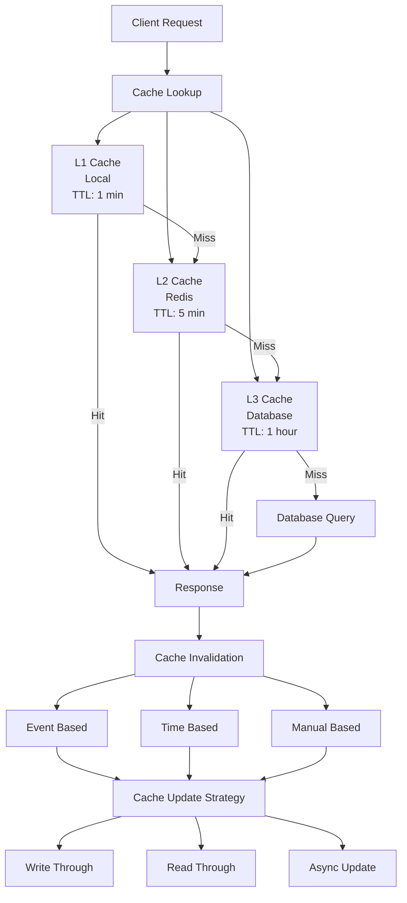
```mermaid
graph TD
    CR[Client Request] --> CL[Cache Lookup]
    
    CL --> L1[L1 Cache<br/>Local<br/>TTL: 1 min]
    CL --> L2[L2 Cache<br/>Redis<br/>TTL: 5 min]
    CL --> L3[L3 Cache<br/>Database<br/>TTL: 1 hour]
    
    L1 -->|Miss| L2
    L2 -->|Miss| L3
    L3 -->|Miss| DB[Database Query]
    
    L1 -->|Hit| RESP[Response]
    L2 -->|Hit| RESP
    L3 -->|Hit| RESP
    DB --> RESP
    
    RESP --> CI[Cache Invalidation]
    CI --> EB[Event Based]
    CI --> TB[Time Based]
    CI --> MB[Manual Based]
    
    EB --> CUS[Cache Update Strategy]
    TB --> CUS
    MB --> CUS
    
    CUS --> WT[Write Through]
    CUS --> RT[Read Through]
    CUS --> AU[Async Update]
```

### Multi-Level Caching

**L1 Cache (Application Level):**
- **Technology**: In-memory cache (Caffeine/Guava)
- **TTL**: 1 minute
- **Size**: 10,000 entries per instance
- **Use case**: Frequently accessed leaderboards

**L2 Cache (Distributed):**
- **Technology**: Redis Cluster
- **TTL**: 5 minutes
- **Size**: 100GB total
- **Use case**: Shared cache across instances

**L3 Cache (Database Level):**
- **Technology**: PostgreSQL query cache
- **TTL**: 1 hour
- **Size**: 50GB
- **Use case**: Complex query results

### Cache Invalidation Strategies

**Event-Based Invalidation:**
- Invalidate cache when new events arrive
- Use Kafka consumer to trigger invalidation
- Selective invalidation by event type

**Time-Based Invalidation:**
- TTL-based expiration
- Different TTLs for different data types
- Proactive refresh before expiration

**Manual Invalidation:**
- Admin-triggered cache clear
- Emergency cache invalidation
- Selective invalidation by patterns


## Count-Min Sketch Deep Dive

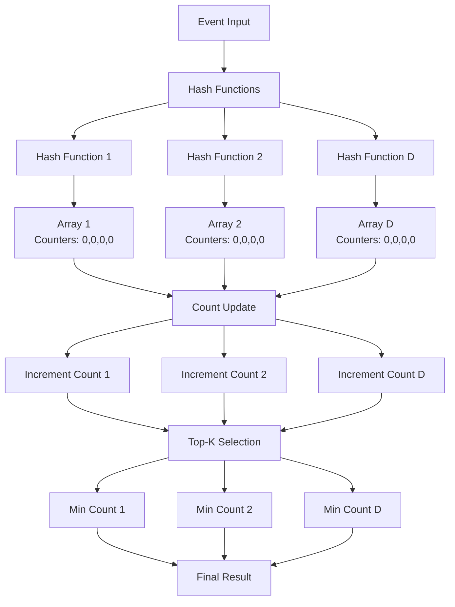
```mermaid
graph TD
    EI[Event Input] --> HF[Hash Functions]
    
    HF --> HF1[Hash Function 1]
    HF --> HF2[Hash Function 2]
    HF --> HFD[Hash Function D]
    
    HF1 --> A1["Array 1<br/>Counters: 0,0,0,0"]
    HF2 --> A2["Array 2<br/>Counters: 0,0,0,0"]
    HFD --> AD["Array D<br/>Counters: 0,0,0,0"]
    
    A1 --> CU[Count Update]
    A2 --> CU
    AD --> CU
    
    CU --> IC1[Increment Count 1]
    CU --> IC2[Increment Count 2]
    CU --> ICD[Increment Count D]
    
    IC1 --> TKS[Top-K Selection]
    IC2 --> TKS
    ICD --> TKS
    
    TKS --> MC1[Min Count 1]
    TKS --> MC2[Min Count 2]
    TKS --> MCD[Min Count D]
    
    MC1 --> RESULT[Final Result]
    MC2 --> RESULT
    MCD --> RESULT
```

### Why Count-Min Sketch?

**Memory Efficiency:**
- Fixed memory footprint regardless of unique items
- O(d × w) space complexity where d=hash functions, w=array width
- Typical usage: 4 hash functions × 16,384 counters = 65KB

**Approximation Guarantees:**
- Overestimate count with probability 1-δ
- Error bound: ε × total_count with probability 1-δ
- Typical parameters: ε=0.01, δ=0.01 (1% error, 99% confidence)

**Performance Benefits:**
- O(1) update time
- O(d) query time
- Cache-friendly memory access pattern

### Implementation Details

**Hash Functions:**
- Use MurmurHash3 for good distribution
- Different seeds for each hash function
- Modulo operation for array indexing

**Array Dimensions:**
- Width (w): ceil(e/ε) where e=Euler's number
- Depth (d): ceil(ln(1/δ))
- Example: ε=0.01, δ=0.01 → w=2,719, d=5

**Update Process:**
1. Hash event key with each hash function
2. Increment corresponding counter in each array
3. Maintain running total for normalization

**Query Process:**
1. Hash event key with each hash function
2. Get count from each array
3. Return minimum count (reduces overestimation)

### Top-K Selection Algorithm

**MinHeap Approach:**
1. Maintain heap of size K
2. For each unique key in sketch:
   - Query count from sketch
   - If count > heap minimum, replace minimum
3. Return heap contents as top-K

**Time Complexity:**
- Update: O(1) per event
- Top-K query: O(n × log K) where n=unique keys
- Space: O(K) for heap + O(d×w) for sketch

## Query Processing Flow

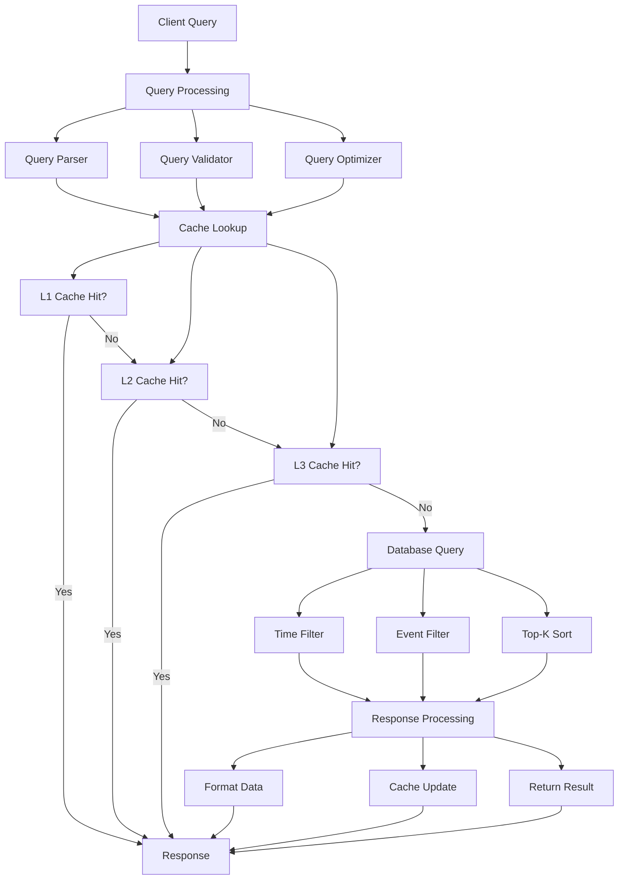
```mermaid
graph TD
    CQ[Client Query] --> QP[Query Processing]
    
    QP --> QPAR[Query Parser]
    QP --> QVAL[Query Validator]
    QP --> QOPT[Query Optimizer]
    
    QPAR --> CL[Cache Lookup]
    QVAL --> CL
    QOPT --> CL
    
    CL --> L1[L1 Cache Hit?]
    CL --> L2[L2 Cache Hit?]
    CL --> L3[L3 Cache Hit?]
    
    L1 -->|Yes| RESP[Response]
    L2 -->|Yes| RESP
    L3 -->|Yes| RESP
    
    L1 -->|No| L2
    L2 -->|No| L3
    L3 -->|No| DBQ[Database Query]
    
    DBQ --> TF[Time Filter]
    DBQ --> EF[Event Filter]
    DBQ --> TKS[Top-K Sort]
    
    TF --> RP[Response Processing]
    EF --> RP
    TKS --> RP
    
    RP --> FD[Format Data]
    RP --> CU[Cache Update]
    RP --> RR[Return Result]
    
    FD --> RESP
    CU --> RESP
    RR --> RESP
```

### Query Types

**Real-time Queries:**
- Current top-K leaderboard
- Last N minutes/hours
- Specific event types

**Historical Queries:**
- Top-K for specific time ranges
- Trend analysis
- Comparative analysis

**Analytical Queries:**
- Event distribution
- User behavior patterns
- Performance metrics

### Query Optimization

**Indexing Strategy:**
- Composite indexes on (event_type, timestamp)
- Partial indexes for active data
- Covering indexes for common queries

**Query Rewriting:**
- Convert subqueries to joins
- Push down filters
- Use materialized views for complex aggregations

**Caching Strategy:**
- Cache query results by pattern
- Invalidate cache on data updates
- Use query result compression

## Fault Tolerance & Recovery

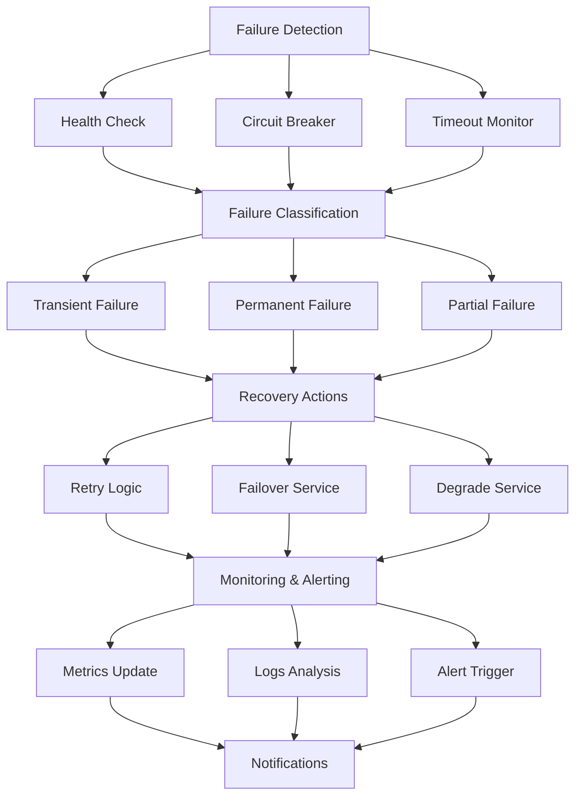
```mermaid
graph TD
    FD[Failure Detection] --> HC[Health Check]
    FD --> CB[Circuit Breaker]
    FD --> TM[Timeout Monitor]
    
    HC --> FC[Failure Classification]
    CB --> FC
    TM --> FC
    
    FC --> TF[Transient Failure]
    FC --> PF[Permanent Failure]
    FC --> PARF[Partial Failure]
    
    TF --> RA[Recovery Actions]
    PF --> RA
    PARF --> RA
    
    RA --> RL[Retry Logic]
    RA --> FS[Failover Service]
    RA --> DS[Degrade Service]
    
    RL --> MA[Monitoring & Alerting]
    FS --> MA
    DS --> MA
    
    MA --> MU[Metrics Update]
    MA --> LA[Logs Analysis]
    MA --> AT[Alert Trigger]
    
    MU --> NOTIF[Notifications]
    LA --> NOTIF
    AT --> NOTIF
```

### Failure Scenarios

**Kafka Broker Failure:**
- **Impact**: Message loss, processing delay
- **Recovery**: Automatic failover to replicas
- **Prevention**: Multi-broker cluster, replication factor 3

**Spark Streaming Failure:**
- **Impact**: Processing interruption
- **Recovery**: Automatic restart from checkpoint
- **Prevention**: Checkpointing, resource monitoring

**Database Failure:**
- **Impact**: Query failures, data inconsistency
- **Recovery**: Failover to replica, data repair
- **Prevention**: Master-slave replication, regular backups

**Cache Failure:**
- **Impact**: Increased latency, database load
- **Recovery**: Cache rebuild, traffic rerouting
- **Prevention**: Redis cluster, multiple cache layers

### Recovery Strategies

**Automatic Recovery:**
- Health checks every 30 seconds
- Circuit breakers for external dependencies
- Automatic service restart with exponential backoff

**Manual Recovery:**
- Admin dashboard for service management
- Data repair tools for consistency issues
- Emergency procedures for critical failures

**Data Recovery:**
- Point-in-time recovery from backups
- Kafka replay for message reprocessing
- Cache warming for performance restoration


## Production-Level Considerations

### Hotspot Mitigation

**The Problem:**
With eventId partitioning in Kafka, a globally viral song/video could create a hotspot where one partition receives 10x more traffic than others, becoming a bottleneck.

**Mitigation Strategy - Key Splitting:**
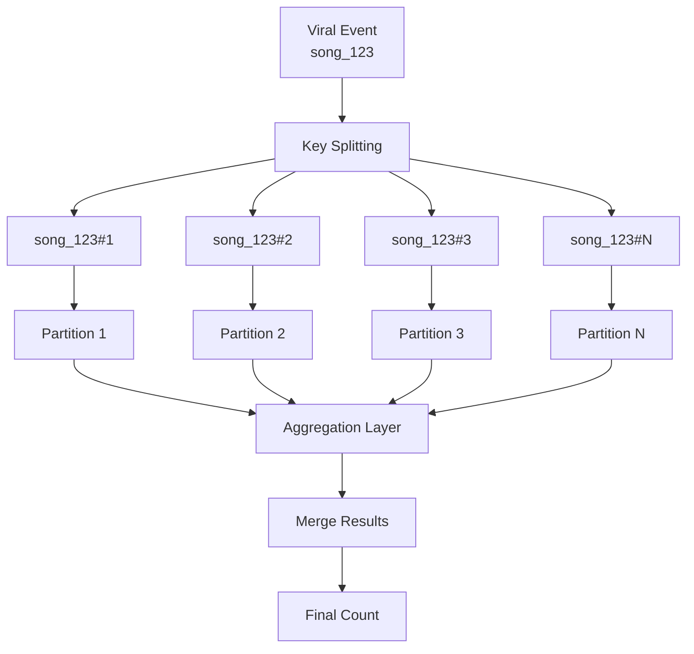
```mermaid
graph TD
    VIRAL[Viral Event<br/>song_123] --> KS[Key Splitting]
    
    KS --> K1[song_123#1]
    KS --> K2[song_123#2]
    KS --> K3[song_123#3]
    KS --> KN[song_123#N]
    
    K1 --> P1[Partition 1]
    K2 --> P2[Partition 2]
    K3 --> P3[Partition 3]
    KN --> PN[Partition N]
    
    P1 --> AG[Aggregation Layer]
    P2 --> AG
    P3 --> AG
    PN --> AG
    
    AG --> MERGE[Merge Results]
    MERGE --> FINAL[Final Count]
```

**Implementation:**
- **Dynamic Sharding**: Monitor partition load, split hot keys when threshold exceeded
- **Consistent Hashing**: Distribute shards across partitions evenly
- **Downstream Aggregation**: Merge sharded results in Spark Streaming
- **Fallback Strategy**: If aggregation fails, use original key

### Query Flexibility & Dual-Path Architecture

**The Challenge:**
Arbitrary time ranges (e.g., "Top songs from Jan-Mar 2024") require merging multiple windows efficiently without scanning billions of raw events.

**Dual-Path Query Design:**
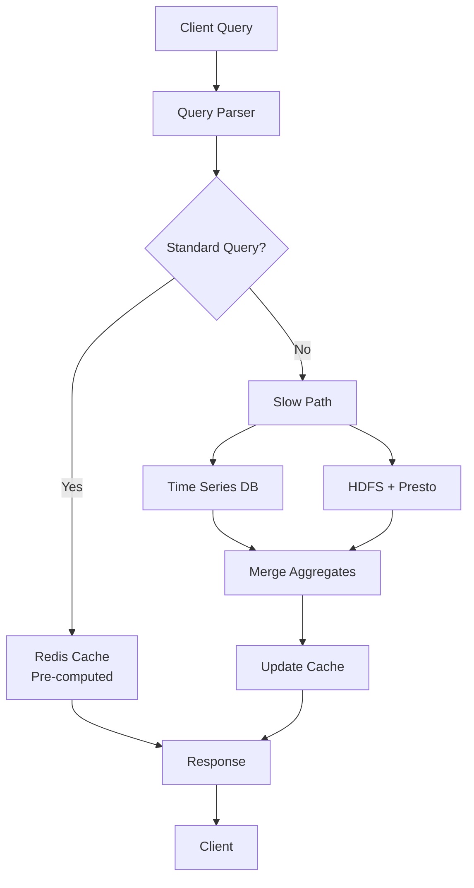
```mermaid
graph TD
    QUERY[Client Query] --> QP[Query Parser]
    
    QP --> FAST{Standard Query?}
    FAST -->|Yes| REDIS[Redis Cache<br/>Pre-computed]
    FAST -->|No| SLOW[Slow Path]
    
    REDIS --> RESPONSE[Response]
    
    SLOW --> TSDB[Time Series DB]
    SLOW --> HDFS[HDFS + Presto]
    
    TSDB --> MERGE[Merge Aggregates]
    HDFS --> MERGE
    
    MERGE --> CACHE[Update Cache]
    CACHE --> RESPONSE
    
    RESPONSE --> CLIENT[Client]
```

**Pre-aggregation Strategy:**
- **Multiple Granularities**: Minute, hour, day, week, month
- **Rollup Tables**: Pre-compute common time ranges
- **Materialized Views**: Cache expensive aggregations
- **Query Routing**: Route to appropriate granularity

### Multi-Tenancy & Isolation

**Tenant Isolation:**
- **Data Partitioning**: Separate Kafka topics per tenant
- **Resource Quotas**: CPU, memory, storage limits per tenant
- **Rate Limiting**: API calls per tenant per minute
- **Security**: Tenant-specific authentication and authorization

**Query Isolation:**
- **Dedicated Resources**: Separate Spark jobs per tenant
- **Cache Namespacing**: Redis keys prefixed with tenant ID
- **Database Schemas**: Separate schemas or row-level security

### Incremental Cache Updates

**Problem with Full Invalidation:**
Complete cache invalidation causes thundering herd and temporary performance degradation.

**Incremental Update Strategy:**
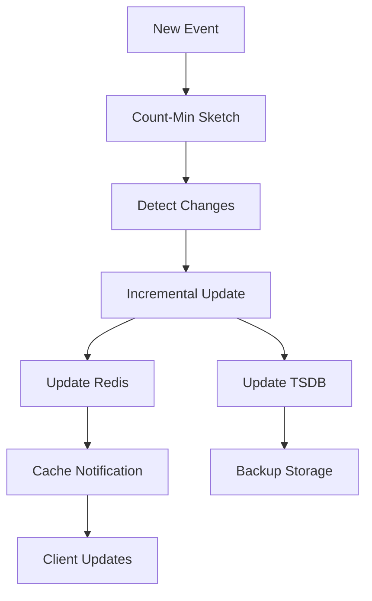
```mermaid
graph TD
    EVENT[New Event] --> CMS[Count-Min Sketch]
    
    CMS --> CHANGE[Detect Changes]
    CHANGE --> INCR[Incremental Update]
    
    INCR --> REDIS[Update Redis]
    INCR --> TSDB[Update TSDB]
    
    REDIS --> NOTIFY[Cache Notification]
    NOTIFY --> CLIENT[Client Updates]
    
    TSDB --> BACKUP[Backup Storage]
```

**Implementation:**
- **Delta Updates**: Only update changed items in cache
- **Event-Driven**: Use Kafka events to trigger cache updates
- **Batch Processing**: Group updates to reduce cache operations
- **Conflict Resolution**: Handle concurrent updates gracefully

## Advanced Algorithms & Optimizations

### Heavy Hitters Algorithms

**Beyond Count-Min Sketch:**
While CMS is excellent for frequency estimation, combining it with streaming algorithms provides more stable top-K results.

**Space-Saving Algorithm:**
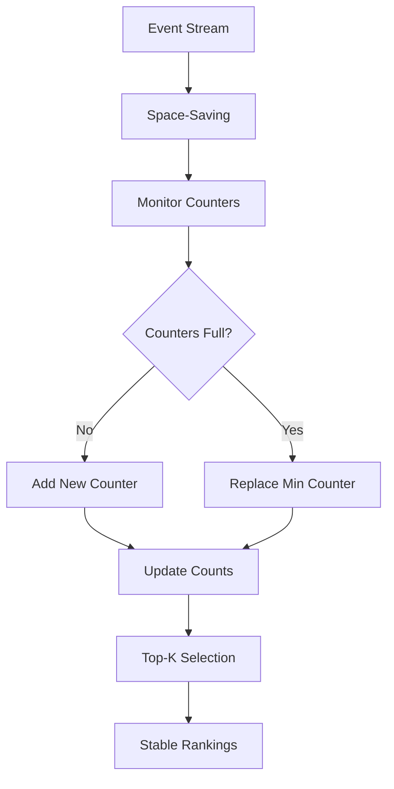
```mermaid
graph TD
    STREAM[Event Stream] --> SS[Space-Saving]
    
    SS --> MONITOR[Monitor Counters]
    MONITOR --> FULL{Counters Full?}
    
    FULL -->|No| ADD[Add New Counter]
    FULL -->|Yes| REPLACE[Replace Min Counter]
    
    ADD --> UPDATE[Update Counts]
    REPLACE --> UPDATE
    
    UPDATE --> TOPK[Top-K Selection]
    TOPK --> RESULT[Stable Rankings]
```

**Misra-Gries Algorithm:**
- **Guaranteed Accuracy**: For top-K with K counters, error ≤ N/(K+1)
- **Memory Efficient**: O(K) space complexity
- **Deterministic**: No probabilistic guarantees needed

**Hybrid Approach:**
- **CMS**: For frequency estimation of all items
- **Space-Saving**: For maintaining top-K candidates
- **Combination**: Use CMS to validate Space-Saving results

### Sliding Windows & Decay

**Exponential Histograms:**
For sliding windows where recent events matter more than old ones.

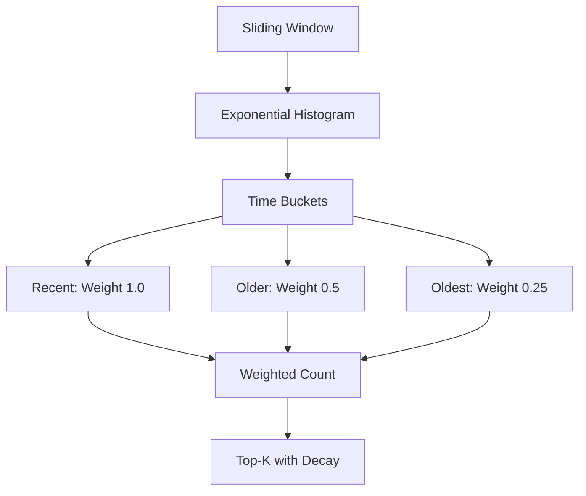
```mermaid
graph TD
    WINDOW[Sliding Window] --> EH[Exponential Histogram]
    
    EH --> BUCKETS[Time Buckets]
    BUCKETS --> B1[Recent: Weight 1.0]
    BUCKETS --> B2[Older: Weight 0.5]
    BUCKETS --> B3[Oldest: Weight 0.25]
    
    B1 --> WEIGHT[Weighted Count]
    B2 --> WEIGHT
    B3 --> WEIGHT
    
    WEIGHT --> TOPK[Top-K with Decay]
```

**Damped Weighted Counts:**
- **Decay Factor**: λ = 0.9 (configurable)
- **Update Rule**: count = λ × old_count + new_weight
- **Benefits**: Naturally handles concept drift

### Ranking Stability

**The Problem:**
Frequent changes in top-K rankings create poor user experience.

**Stability Mechanisms:**
- **Hysteresis**: Require significant change to update ranking
- **Smoothing**: Use moving averages for counts
- **Confidence Intervals**: Only show rankings with high confidence
- **Temporal Consistency**: Ensure rankings don't change too rapidly

## Data Lifecycle & Storage Tiers

### Multi-Tier Storage Strategy

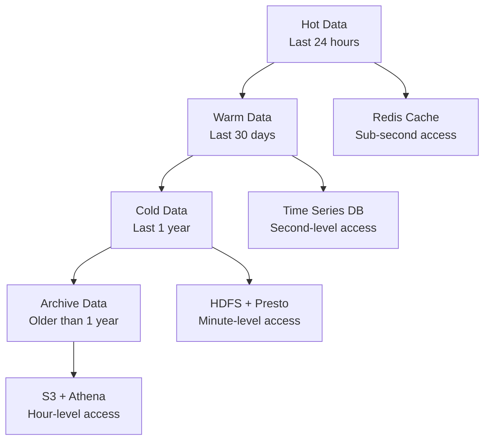
```mermaid
graph TD
    HOT[Hot Data<br/>Last 24 hours] --> WARM[Warm Data<br/>Last 30 days]
    WARM --> COLD[Cold Data<br/>Last 1 year]
    COLD --> ARCHIVE[Archive Data<br/>Older than 1 year]
    
    HOT --> REDIS[Redis Cache<br/>Sub-second access]
    WARM --> TSDB[Time Series DB<br/>Second-level access]
    COLD --> HDFS[HDFS + Presto<br/>Minute-level access]
    ARCHIVE --> S3[S3 + Athena<br/>Hour-level access]
```

### Storage Cost Optimization

**Cost Analysis (per TB per month):**
- **Redis**: $200-400 (memory-based)
- **Time Series DB**: $50-100 (SSD storage)
- **HDFS**: $20-40 (HDD storage)
- **S3 Standard**: $23 (object storage)
- **S3 Glacier**: $4 (archival storage)

**Lifecycle Policies:**
- **Hot → Warm**: After 24 hours
- **Warm → Cold**: After 30 days
- **Cold → Archive**: After 1 year
- **Archive → Delete**: After 7 years (compliance)

### Query Performance Optimization

**Query Routing Strategy:**
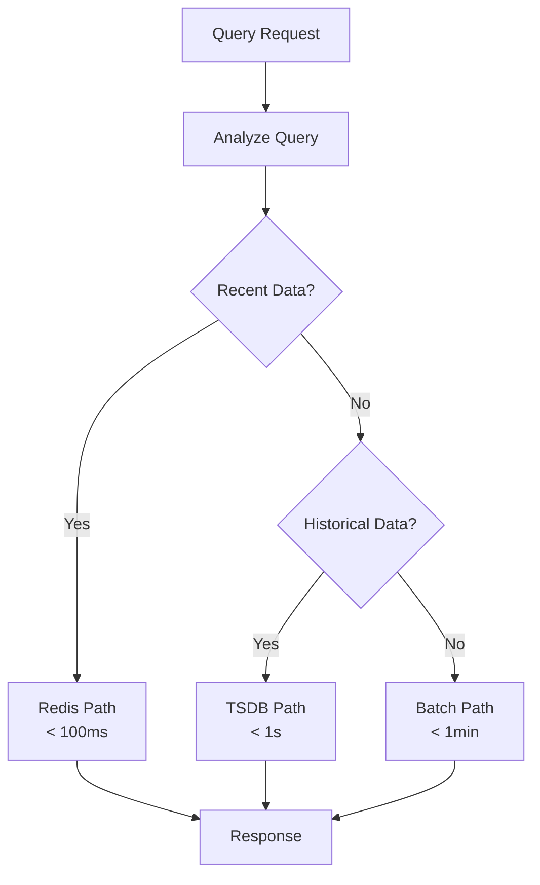
```mermaid
graph TD
    QUERY[Query Request] --> ANALYZE[Analyze Query]
    
    ANALYZE --> RECENT{Recent Data?}
    RECENT -->|Yes| REDIS[Redis Path<br/>< 100ms]
    RECENT -->|No| HISTORICAL{Historical Data?}
    
    HISTORICAL -->|Yes| TSDB[TSDB Path<br/>< 1s]
    HISTORICAL -->|No| BATCH[Batch Path<br/>< 1min]
    
    REDIS --> RESPONSE[Response]
    TSDB --> RESPONSE
    BATCH --> RESPONSE
```

**Precomputation Strategy:**
- **Common Queries**: Pre-compute top-K for popular time ranges
- **Materialized Views**: Cache expensive aggregations
- **Rollup Tables**: Store data at multiple granularities
- **Predictive Caching**: Pre-load likely queries

### Data Compression & Retention

**Compression Techniques:**
- **Parquet**: Columnar format with 80-90% compression
- **Snappy**: Fast compression for real-time data
- **LZ4**: High-speed compression for cache data
- **Gzip**: Maximum compression for archival data

**Retention Policies:**
- **Real-time**: 24 hours (Redis)
- **Recent**: 30 days (Time Series DB)
- **Historical**: 1 year (HDFS)
- **Archive**: 7 years (S3 Glacier)
- **Compliance**: Indefinite (encrypted S3)

## Design Decisions & Trade-offs

### Consistency Models

**Eventual Consistency (Recommended):**
- **Why**: Global strong consistency is extremely difficult and expensive
- **Implementation**: Each region maintains its own leaderboard, sync periodically
- **Trade-off**: Users might see slightly different rankings across regions
- **Mitigation**: Use timestamps and conflict resolution for critical updates

**Strong Consistency (If Required):**
- **Implementation**: Distributed consensus (Raft/Paxos) across regions
- **Cost**: 10x higher latency, complex failure handling
- **Use Case**: Financial transactions, critical business metrics

### Approximation Error Tolerance

**Typical Tolerance Levels:**
- **User-facing dashboards**: 1-2% error acceptable
- **Business analytics**: 5% error acceptable  
- **Internal monitoring**: 10% error acceptable

**Error Sources:**
- **Count-Min Sketch**: Overestimation by ε × total_count
- **Sampling**: If using sampling for very high volume
- **Network partitions**: Temporary inconsistencies

**Mitigation Strategies:**
- **Confidence intervals**: Report error bounds to users
- **Validation**: Cross-check with exact counts periodically
- **Fallback**: Use exact computation for critical queries

### Query Latency Requirements

**Real-time Dashboards (< 100ms):**
- **Architecture**: Redis cache + pre-computed results
- **Data**: Last 24 hours only
- **Approximation**: Count-Min Sketch acceptable
- **Use Case**: Live leaderboards, trending topics

**Analytics Queries (< 1 second):**
- **Architecture**: Time Series DB + materialized views
- **Data**: Last 30 days
- **Approximation**: Minimal, prefer exact counts
- **Use Case**: Business reports, user analytics

**Historical Analysis (< 1 minute):**
- **Architecture**: HDFS + Presto/Spark
- **Data**: All historical data
- **Approximation**: None, exact computation
- **Use Case**: Data science, compliance reporting

### Geographic Distribution Strategy

**Active-Active Regions:**
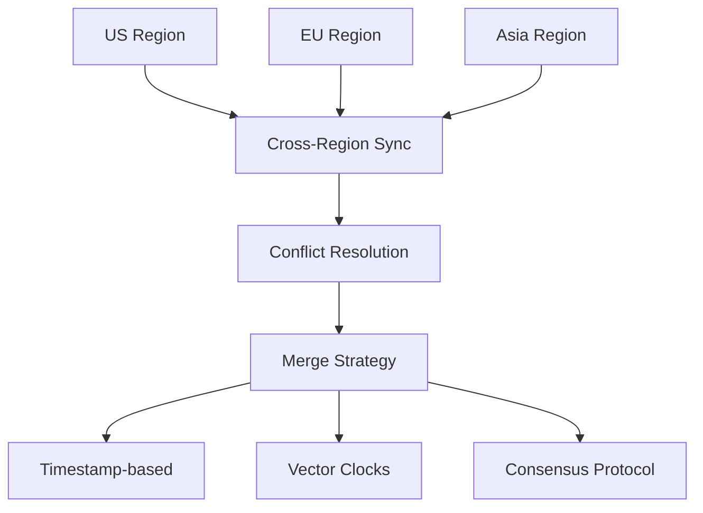
```mermaid
graph TD
    US[US Region] --> SYNC[Cross-Region Sync]
    EU[EU Region] --> SYNC
    ASIA[Asia Region] --> SYNC
    
    SYNC --> CONFLICT[Conflict Resolution]
    CONFLICT --> MERGE[Merge Strategy]
    
    MERGE --> TIMESTAMP[Timestamp-based]
    MERGE --> VECTOR[Vector Clocks]
    MERGE --> CONSENSUS[Consensus Protocol]
```

**Implementation Options:**
- **Timestamp-based**: Last-write-wins with conflict detection
- **Vector Clocks**: Track causality across regions
- **CRDTs**: Conflict-free replicated data types
- **Event Sourcing**: Replay events to resolve conflicts

---

## Conclusion

This Top-K Leaderboard system design demonstrates the evolution from a simple MVP to an enterprise-scale solution. The key architectural decisions are driven by:

1. **Scalability requirements**: From single database to distributed processing
2. **Performance needs**: From synchronous to asynchronous processing
3. **Reliability demands**: From single points of failure to fault-tolerant systems
4. **Cost optimization**: From vertical to horizontal scaling

The technology choices reflect a balance between performance, complexity, and maintainability, with each phase building upon the previous one while addressing new challenges as the system scales.

The design emphasizes the "why" behind each decision, providing alternatives and trade-offs to help understand the reasoning process. This approach ensures that the system can evolve and adapt as requirements change and new technologies emerge.
