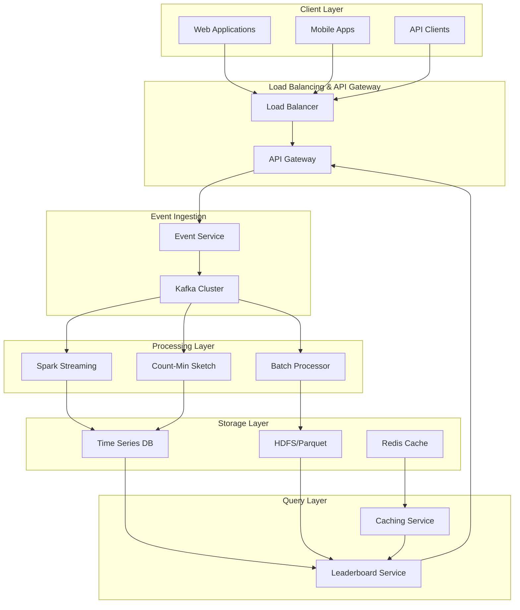
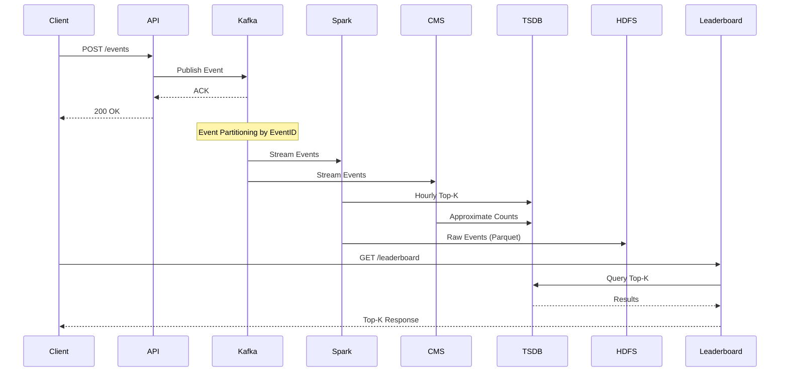
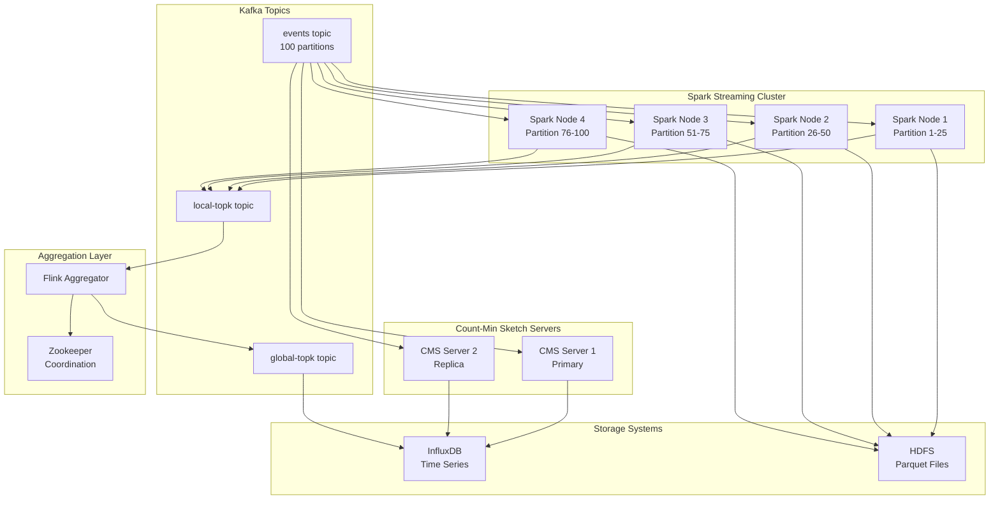
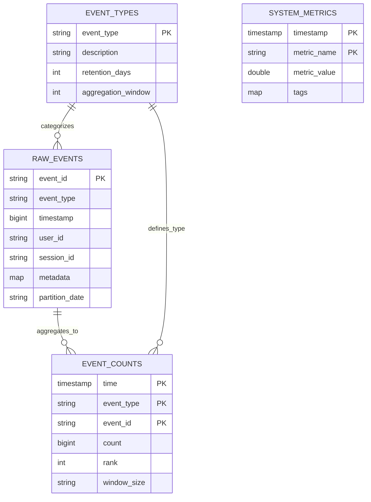
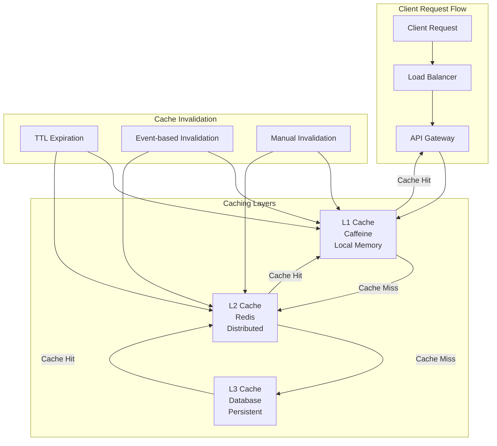
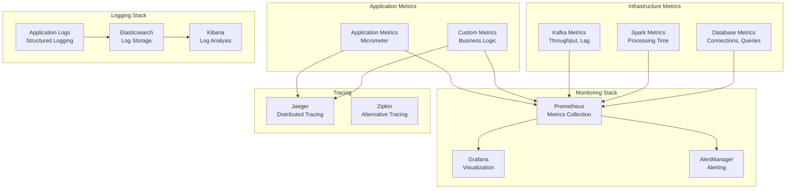
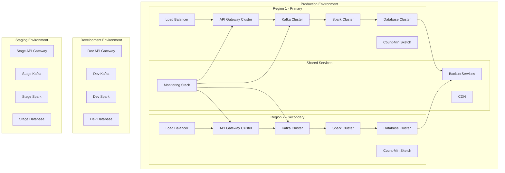
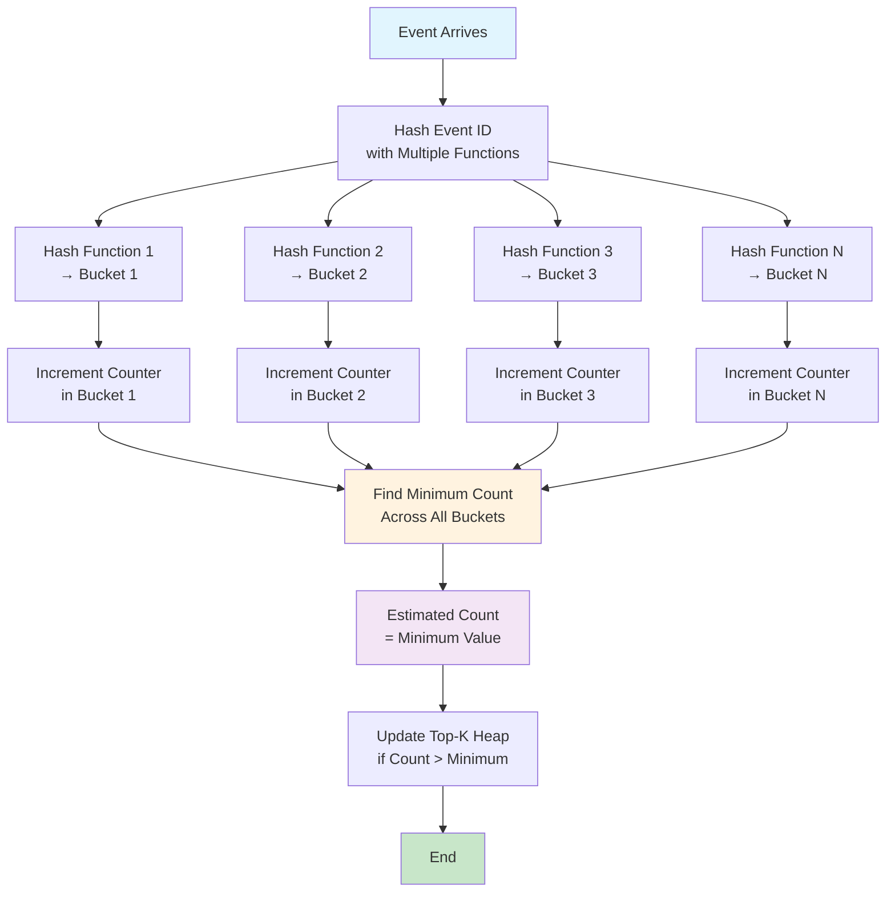
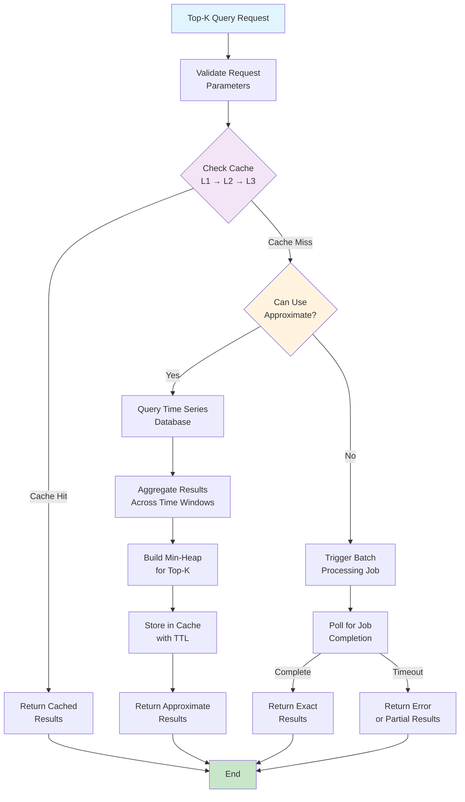
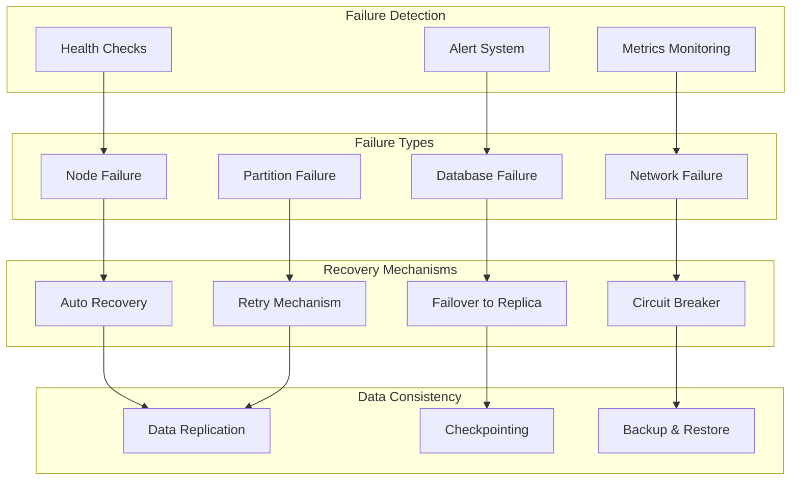

# Top-K Leaderboard System Design - Scaling from 0 to Millions

## Table of Contents
1. [Problem Statement](#problem-statement)
2. [Scaling Journey: 0 to Millions](#scaling-journey-0-to-millions)
3. [Functional Requirements](#functional-requirements)
4. [Non-Functional Requirements](#non-functional-requirements)
5. [Capacity Estimation](#capacity-estimation)
6. [Architecture Approaches & Alternatives](#architecture-approaches--alternatives)
7. [Detailed System Design](#detailed-system-design)
8. [Database Schema Design](#database-schema-design)
9. [Performance Optimizations](#performance-optimizations)
10. [Monitoring and Observability](#monitoring-and-observability)
11. [System Architecture Diagrams](#system-architecture-diagrams)
12. [Conclusion](#conclusion)

## Problem Statement

Design a distributed system to find the top-K most popular events over arbitrary time ranges. Examples include:
- Top-K search terms on Google over any time period
- Top-K most viewed YouTube videos
- Top-K most played songs on Spotify this week
- Top-K trending hashtags on social media

**Key Challenge**: Handle billions of events per day while providing fast reads for arbitrary time ranges and K values.

## Scaling Journey: 0 to Millions

### Phase 1: MVP (0-1K users)
**Requirements:**
- Simple leaderboard for single event type
- Basic time windows (hour, day)
- Small K values (top 10-50)

**Architecture:**
```
Client → API → Database → Response
```

**Why this approach:**
- **Simplicity**: Single database handles everything
- **Cost-effective**: Minimal infrastructure
- **Fast development**: Can be built in days

**Alternatives considered:**
- **In-memory cache**: Too volatile for persistence
- **File-based storage**: Poor query performance
- **NoSQL**: Overkill for simple queries

### Phase 2: Growth (1K-100K users)
**Requirements:**
- Multiple event types
- Real-time updates
- Caching for performance

**Architecture:**
```
Client → Load Balancer → API → Cache → Database
```

**Why this approach:**
- **Caching**: Reduces database load by 80-90%
- **Load balancing**: Handles traffic spikes
- **Database optimization**: Indexes and partitioning

**Alternatives considered:**
- **Read replicas**: More complex than caching
- **CDN**: Not suitable for dynamic data
- **Microservices**: Premature optimization

### Phase 3: Scale (100K-1M users)
**Requirements:**
- Multiple regions
- Event streaming
- Approximate algorithms

**Architecture:**
```
Client → CDN → Load Balancer → API → Message Queue → Stream Processing → Multiple Databases
```

**Why this approach:**
- **Message queues**: Decouple ingestion from processing
- **Stream processing**: Real-time aggregation
- **Approximate algorithms**: Trade accuracy for speed

**Alternatives considered:**
- **Batch processing only**: Too slow for real-time
- **Exact algorithms only**: Too expensive for scale
- **Single region**: Latency issues

### Phase 4: Enterprise (1M+ users)
**Requirements:**
- Global distribution
- Sub-second latency
- 99.99% availability

**Architecture:**
```
Global CDN → Multi-Region Load Balancers → Microservices → Event Streaming → Distributed Processing → Multi-Database
```

**Why this approach:**
- **Global CDN**: Reduces latency worldwide
- **Multi-region**: Fault tolerance and performance
- **Microservices**: Independent scaling and deployment

**Alternatives considered:**
- **Monolithic architecture**: Scaling bottlenecks
- **Single database**: Single point of failure
- **Synchronous processing**: Performance limitations

## Functional Requirements

### Core Features
1. **Event Ingestion**
   - Accept high-volume event streams (millions per second)
   - Support various event types (search terms, video views, song plays)
   - Maintain event timestamps for time-range queries

2. **Top-K Queries**
   - Support arbitrary time ranges (last hour, last week, custom date range)
   - Support variable K values (typically K < 1000)
   - Return ranked results with counts

3. **Data Persistence**
   - Store all events for exact queries
   - Maintain aggregated data for fast approximate queries
   - Support both real-time and batch processing

### API Requirements
```
POST /events
{
  "eventId": "song_123",
  "eventType": "song_play",
  "timestamp": "2024-01-15T10:30:00Z",
  "userId": "user_456",
  "metadata": {...}
}

GET /leaderboard?timeRange=last_3_hours&k=10&eventType=song_play
Response:
{
  "timeRange": "2024-01-15T07:30:00Z to 2024-01-15T10:30:00Z",
  "results": [
    {"eventId": "song_123", "count": 1500000, "rank": 1},
    {"eventId": "song_456", "count": 1200000, "rank": 2},
    ...
  ]
}
```

## Non-Functional Requirements

### Performance Requirements
- **Write Latency**: < 10ms for event ingestion
- **Read Latency**: < 100ms for approximate queries, < 5s for exact queries
- **Throughput**: 100,000+ events/second ingestion
- **Availability**: 99.9% uptime

### Scalability Requirements
- **Horizontal Scaling**: Support adding nodes dynamically
- **Data Volume**: Handle 1 billion+ events per day
- **Storage**: Efficiently store and retrieve large datasets
- **Geographic Distribution**: Support multi-region deployment

### Consistency Requirements
- **Eventual Consistency**: Acceptable for approximate queries
- **Strong Consistency**: Required for exact queries
- **Data Durability**: Zero data loss guarantee

### Reliability Requirements
- **Fault Tolerance**: Handle node failures gracefully
- **Data Backup**: Regular backups with point-in-time recovery
- **Disaster Recovery**: Cross-region replication

## Capacity Estimation

### Data Volume Calculations

**Assumptions:**
- 100,000 events/second average (Google-scale)
- Peak traffic: 3x average = 300,000 events/second
- Event size: 200 bytes average
- Retention period: 1 year

**Daily Calculations:**
```
Events per day = 100,000 × 86,400 = 8.64 billion events
Daily data volume = 8.64B × 200 bytes = 1.73 TB/day
Annual storage = 1.73 TB × 365 = 631 TB/year
```

**Storage Requirements:**
- Raw events (Parquet): 631 TB/year
- Aggregated data: ~50 TB/year (compressed)
- Indexes and metadata: ~20 TB/year
- **Total storage needed: ~700 TB/year**

### Network Bandwidth
```
Peak ingestion = 300,000 events/sec × 200 bytes = 60 MB/sec
Replication factor = 3
Total network = 60 MB/sec × 3 = 180 MB/sec per region
```

### Memory Requirements
```
Count-Min Sketch per node:
- Hash functions: 5
- Buckets per function: 1M
- Memory per sketch: 5 × 1M × 4 bytes = 20 MB
- Multiple sketches per node: 20 MB × 10 = 200 MB
```

### Compute Requirements
```
Spark Streaming nodes: 20 nodes
- CPU: 16 cores per node
- RAM: 64 GB per node
- Storage: 2 TB SSD per node

Count-Min Sketch servers: 5 nodes
- CPU: 32 cores per node
- RAM: 128 GB per node
- Network: 10 Gbps per node
```

## Architecture Approaches & Alternatives

### Approach 1: Exact Solution (Batch Processing)

**Architecture:**
```
Events → Message Queue → Batch Processing → Data Warehouse → Results
```

**Why choose this:**
- **Accuracy**: 100% precise results
- **Flexibility**: Handles any time range
- **Compliance**: Meets audit requirements

**When to use:**
- Business analytics and reporting
- Compliance and audit trails
- Historical data analysis
- Financial calculations

**Alternatives considered:**
- **Real-time processing**: Too expensive for exact calculations
- **Approximate algorithms**: Insufficient accuracy
- **In-memory processing**: Limited by memory constraints

**Trade-offs:**
- ✅ **Accuracy**: Perfect results
- ❌ **Latency**: 5-30 seconds
- ❌ **Cost**: High computational resources
- ❌ **Complexity**: Requires data engineering expertise

### Approach 2: Approximate Solution (Stream Processing)

**Architecture:**
```
Events → Message Queue → Stream Processing → Time Series DB → Fast Queries
```

**Why choose this:**
- **Speed**: Sub-100ms response times
- **Cost**: Efficient resource usage
- **Scalability**: Handles millions of events
- **Real-time**: Immediate updates

**When to use:**
- User-facing dashboards
- Real-time monitoring
- Gaming leaderboards
- Social media trends

**Alternatives considered:**
- **Batch processing**: Too slow for real-time
- **Exact algorithms**: Too expensive at scale
- **Simple counting**: Insufficient for complex queries

**Trade-offs:**
- ✅ **Speed**: Very fast responses
- ✅ **Cost**: Efficient resource usage
- ❌ **Accuracy**: 95-99% accuracy
- ❌ **Flexibility**: Limited time granularity

### Approach 3: Hybrid Solution (Recommended)

**Architecture:**
```
Events → Message Queue → [Stream Processing + Batch Processing] → [Time Series DB + Data Warehouse]
```

**Why choose this:**
- **Flexibility**: Supports both real-time and batch use cases
- **Optimization**: Right tool for each job
- **Future-proof**: Can evolve with requirements
- **Cost-effective**: Optimizes resource usage

**When to use:**
- Enterprise applications
- Multi-tenant platforms
- Evolving requirements
- Mixed workload patterns

**Alternatives considered:**
- **Single approach**: Either too slow or too inaccurate
- **Custom solutions**: Too complex to maintain
- **Third-party services**: Vendor lock-in risks

**Trade-offs:**
- ✅ **Flexibility**: Best of both worlds
- ✅ **Performance**: Optimized for each use case
- ❌ **Complexity**: Higher operational overhead
- ❌ **Cost**: Multiple systems to maintain

### Approach 4: Serverless Solution

**Architecture:**
```
Events → Event Bridge → Lambda Functions → DynamoDB/CloudWatch → API Gateway
```

**Why choose this:**
- **Zero maintenance**: No infrastructure management
- **Auto-scaling**: Handles traffic spikes automatically
- **Cost-effective**: Pay only for usage
- **Fast deployment**: Quick to implement

**When to use:**
- Startups and MVPs
- Variable workloads
- Limited DevOps resources
- Rapid prototyping

**Alternatives considered:**
- **Containerized services**: More control but higher maintenance
- **Managed services**: Better for predictable workloads
- **On-premises**: Higher upfront costs

**Trade-offs:**
- ✅ **Simplicity**: Minimal operational overhead
- ✅ **Scalability**: Automatic scaling
- ❌ **Vendor lock-in**: Platform dependency
- ❌ **Cost**: Can be expensive at scale

## Detailed System Design

### High-Level Architecture

```
┌─────────────────┐    ┌─────────────────┐    ┌─────────────────┐
│   Event Sources │    │   Load Balancer │    │   API Gateway   │
│   (Web, Mobile) │───▶│                 │───▶│                 │
└─────────────────┘    └─────────────────┘    └─────────────────┘
                                                         │
                                                         ▼
┌─────────────────────────────────────────────────────────────────┐
│                        Kafka Cluster                            │
│  ┌─────────────┐  ┌─────────────┐  ┌─────────────┐             │
│  │ Partition 1 │  │ Partition 2 │  │ Partition N │             │
│  └─────────────┘  └─────────────┘  └─────────────┘             │
└─────────────────────────────────────────────────────────────────┘
                                │
                    ┌───────────┼───────────┐
                    ▼           ▼           ▼
        ┌─────────────────┐ ┌─────────────────┐ ┌─────────────────┐
        │ Spark Streaming │ │ Count-Min Sketch│ │   Batch Jobs    │
        │   (Exact)       │ │  (Approximate)  │ │   (Historical)  │
        └─────────────────┘ └─────────────────┘ └─────────────────┘
                    │           │           │
                    ▼           ▼           ▼
        ┌─────────────────┐ ┌─────────────────┐ ┌─────────────────┐
        │   Time Series   │ │   Time Series   │ │      HDFS       │
        │      DB         │ │      DB         │ │   (Parquet)     │
        └─────────────────┘ └─────────────────┘ └─────────────────┘
                    │           │           │
                    └───────────┼───────────┘
                                ▼
                    ┌─────────────────┐
                    │ Leaderboard     │
                    │ Service         │
                    └─────────────────┘
```

### Component Details

#### 1. Event Ingestion Layer

**Kafka Configuration:**
```yaml
topics:
  - name: "events"
    partitions: 100
    replication-factor: 3
    retention: 7 days
    
partitioning-strategy: "eventId.hash() % partitions"
```

**Event Schema:**
```json
{
  "eventId": "string",
  "eventType": "string", 
  "timestamp": "long",
  "userId": "string",
  "sessionId": "string",
  "metadata": "map<string,string>"
}
```

#### 2. Stream Processing Layer

**Why Stream Processing:**
- **Real-time aggregation**: Process events as they arrive
- **Scalability**: Handle millions of events per second
- **Fault tolerance**: Built-in checkpointing and recovery
- **Windowing**: Natural support for time-based aggregations

**Technology Choices:**
- **Apache Kafka**: High-throughput message queuing
- **Apache Flink**: Low-latency stream processing
- **Apache Spark Streaming**: Batch-like processing with micro-batches

**Alternatives considered:**
- **Apache Storm**: Lower-level, more complex
- **Apache Samza**: Tied to Kafka ecosystem
- **AWS Kinesis**: Vendor lock-in concerns

**Processing Strategy:**
```
Events → Windowing → Aggregation → Top-K Selection → Storage
```

#### 3. Count-Min Sketch Algorithm

**Why Count-Min Sketch:**
- **Memory efficient**: Fixed memory footprint
- **Fast updates**: O(1) insertion time
- **Approximate accuracy**: 95-99% accuracy with proper tuning
- **Scalable**: Works with billions of unique items

**Algorithm Overview:**
1. **Hash Functions**: Multiple independent hash functions
2. **Buckets**: Each hash function maps to different buckets
3. **Increment**: Increment counters in all mapped buckets
4. **Estimation**: Take minimum count across all buckets

**Alternatives considered:**
- **HyperLogLog**: Only for cardinality, not counts
- **Bloom Filter**: Only for membership, not counts
- **Exact counting**: Too memory-intensive at scale

**Trade-offs:**
- ✅ **Memory**: Constant memory usage
- ✅ **Speed**: Very fast updates and queries
- ❌ **Accuracy**: Approximate results only
- ❌ **Tuning**: Requires careful parameter selection

#### 4. Time Series Database

**Why Time Series Database:**
- **Optimized for time-based queries**: Efficient range queries
- **Compression**: Automatic data compression over time
- **Retention policies**: Automatic data lifecycle management
- **Aggregation**: Built-in time-based aggregation functions

**Technology Choices:**
- **InfluxDB**: High-performance time series database
- **TimescaleDB**: PostgreSQL extension for time series
- **ClickHouse**: Columnar database optimized for analytics

**Alternatives considered:**
- **PostgreSQL**: Not optimized for time series workloads
- **MongoDB**: Document-based, not ideal for time series
- **Redis**: In-memory, not suitable for historical data

**Query Patterns:**
- **Time range queries**: Most common pattern
- **Aggregation queries**: SUM, COUNT, AVG over time windows
- **Top-K queries**: Ranking within time ranges

## Database Schema Design

### 1. Raw Events Table (HDFS/Parquet)

```sql
CREATE TABLE raw_events (
    event_id STRING,
    event_type STRING,
    timestamp BIGINT,
    user_id STRING,
    session_id STRING,
    metadata MAP<STRING, STRING>,
    partition_date STRING
) 
PARTITIONED BY (partition_date)
STORED AS PARQUET
LOCATION 'hdfs://cluster/raw_events/'
```

**Partitioning Strategy:**
- Partition by date: `YYYY-MM-DD`
- Sub-partition by hour: `YYYY-MM-DD-HH`
- Benefits: Efficient time-range queries, parallel processing

**Indexes:**
```sql
-- Event ID index for exact lookups
CREATE INDEX idx_event_id ON raw_events(event_id);

-- Composite index for time-range queries
CREATE INDEX idx_time_event ON raw_events(timestamp, event_id);

-- Event type index for filtering
CREATE INDEX idx_event_type ON raw_events(event_type);
```

### 2. Aggregated Counts Table (Time Series DB)

```sql
CREATE TABLE event_counts (
    time TIMESTAMP,
    event_type STRING,
    event_id STRING,
    count BIGINT,
    rank INT,
    window_size STRING
) 
PRIMARY KEY (time, event_type, event_id)
```

**Indexes:**
```sql
-- Time-based queries
CREATE INDEX idx_time ON event_counts(time);

-- Event type filtering
CREATE INDEX idx_event_type ON event_counts(event_type);

-- Count-based sorting
CREATE INDEX idx_count ON event_counts(count DESC);
```

### 3. Top-K Cache Table (Redis)

```redis
# Key pattern: topk:{eventType}:{timeWindow}:{k}
SET topk:song_play:last_hour:10 '{"results":[...]}' EX 3600

# Key pattern: count:{eventId}:{timeWindow}
SET count:song_123:last_hour 1500000 EX 3600
```

### 4. Metadata Tables

```sql
CREATE TABLE event_types (
    event_type STRING PRIMARY KEY,
    description STRING,
    retention_days INT,
    aggregation_window INT
);

CREATE TABLE system_metrics (
    timestamp TIMESTAMP,
    metric_name STRING,
    metric_value DOUBLE,
    tags MAP<STRING, STRING>
);
```

## Performance Optimizations

### 1. Caching Strategy

**Why Multi-Level Caching:**
- **L1 Cache (Local)**: Fastest access, limited capacity
- **L2 Cache (Distributed)**: Shared across instances, larger capacity
- **L3 Cache (Database)**: Persistent storage, unlimited capacity

**Cache Invalidation Strategies:**
- **TTL-based**: Automatic expiration after time period
- **Event-based**: Invalidate when underlying data changes
- **Manual**: Administrative control for critical updates

**Alternatives considered:**
- **Single-level caching**: Either too slow or too limited
- **Write-through caching**: Higher write latency
- **Write-behind caching**: Risk of data loss

### 2. Connection Pooling

**Why Connection Pooling:**
- **Resource efficiency**: Reuse expensive database connections
- **Performance**: Avoid connection establishment overhead
- **Scalability**: Handle concurrent requests efficiently

**Pool Configuration:**
- **Maximum pool size**: Based on database connection limits
- **Minimum idle connections**: Maintain warm connections
- **Connection timeout**: Prevent hanging connections
- **Idle timeout**: Clean up unused connections

**Alternatives considered:**
- **Connection per request**: Too expensive at scale
- **Single connection**: Bottleneck for concurrent requests
- **Connectionless**: Not suitable for transactional workloads

### 3. Async Processing

**Why Async Processing:**
- **Non-blocking**: Don't wait for slow operations
- **Resource utilization**: Better CPU and I/O utilization
- **Scalability**: Handle more concurrent requests

**Processing Patterns:**
- **Fire-and-forget**: For non-critical operations
- **Callback-based**: For operations requiring results
- **Promise-based**: For complex async workflows

**Alternatives considered:**
- **Synchronous processing**: Blocking and slow
- **Thread-per-request**: Resource intensive
- **Event loops**: Complex to implement correctly

## Monitoring and Observability

### 1. Metrics Collection Strategy

**Why Comprehensive Metrics:**
- **Performance monitoring**: Track system performance in real-time
- **Capacity planning**: Understand resource usage patterns
- **Troubleshooting**: Quickly identify and resolve issues
- **Business insights**: Understand user behavior and system usage

**Key Metrics Categories:**
- **Application metrics**: Request rates, response times, error rates
- **Infrastructure metrics**: CPU, memory, disk, network usage
- **Business metrics**: Event counts, top-K accuracy, user engagement
- **Custom metrics**: Domain-specific measurements

**Alternatives considered:**
- **Log-based monitoring**: Too slow for real-time alerts
- **Sampling**: May miss critical events
- **Manual monitoring**: Not scalable for large systems

### 2. Logging Strategy

**Why Structured Logging:**
- **Searchability**: Easy to find specific events
- **Correlation**: Track requests across multiple services
- **Analysis**: Automated log analysis and insights
- **Compliance**: Meet audit and regulatory requirements

**Log Levels and Usage:**
- **ERROR**: System errors requiring immediate attention
- **WARN**: Potential issues that need monitoring
- **INFO**: Important business events and state changes
- **DEBUG**: Detailed information for troubleshooting

**Alternatives considered:**
- **Unstructured logging**: Difficult to analyze
- **Console-only logging**: Not suitable for production
- **File-based logging**: Limited scalability

### 3. Alerting Strategy

**Why Proactive Alerting:**
- **Early detection**: Catch issues before they impact users
- **Automated response**: Trigger automatic recovery actions
- **Escalation**: Ensure critical issues get proper attention
- **Learning**: Improve system reliability over time

**Alert Types:**
- **Threshold-based**: Alert when metrics exceed limits
- **Anomaly detection**: Alert on unusual patterns
- **Composite alerts**: Alert based on multiple conditions
- **Business alerts**: Alert on business-critical events

**Alternatives considered:**
- **Reactive monitoring**: Too late to prevent issues
- **Manual monitoring**: Not scalable for 24/7 operations
- **Over-alerting**: Alert fatigue reduces effectiveness

## System Architecture Diagrams

### 1. High-Level System Architecture



### 2. Data Flow Architecture



### 3. Detailed Processing Architecture



### 4. Database Schema Relationships



### 5. Caching Strategy Architecture



### 6. Monitoring and Observability



### 7. Deployment Architecture



### 8. Count-Min Sketch Algorithm Flow



### 9. Query Processing Flow



### 10. Failure Handling and Recovery



## Conclusion

This Top-K Leaderboard system design provides a comprehensive scaling strategy from 0 to millions of users:

### **Scaling Journey Summary:**

**Phase 1 (0-1K users)**: Simple database solution
- **Focus**: Speed to market, minimal complexity
- **Architecture**: Monolithic, single database
- **Cost**: Low infrastructure costs

**Phase 2 (1K-100K users)**: Caching and optimization
- **Focus**: Performance optimization, user experience
- **Architecture**: Load balancing, caching layers
- **Cost**: Moderate infrastructure scaling

**Phase 3 (100K-1M users)**: Distributed processing
- **Focus**: Real-time capabilities, scalability
- **Architecture**: Message queues, stream processing
- **Cost**: Significant infrastructure investment

**Phase 4 (1M+ users)**: Global enterprise solution
- **Focus**: Global reach, enterprise reliability
- **Architecture**: Multi-region, microservices
- **Cost**: Enterprise-level infrastructure

### **Key Architectural Decisions:**

1. **Hybrid Approach**: Combines exact and approximate solutions
   - **Why**: Balances accuracy with performance
   - **Alternatives**: Single approach would be limiting

2. **Count-Min Sketch**: Approximate counting algorithm
   - **Why**: Memory-efficient, fast updates
   - **Alternatives**: Exact counting too expensive at scale

3. **Time Series Database**: Optimized for time-based queries
   - **Why**: Natural fit for leaderboard queries
   - **Alternatives**: Relational databases less efficient

4. **Stream Processing**: Real-time event processing
   - **Why**: Enables real-time leaderboards
   - **Alternatives**: Batch-only processing too slow

### **Technology Stack Evolution:**

**Phase 1**: PostgreSQL + Redis + Simple API
**Phase 2**: PostgreSQL + Redis + Load Balancer + CDN
**Phase 3**: Kafka + Flink + InfluxDB + Microservices
**Phase 4**: Multi-region + Global CDN + Advanced monitoring

### **Performance Characteristics:**

- **Write Latency**: < 10ms (all phases)
- **Read Latency**: < 100ms (approximate), < 5s (exact)
- **Throughput**: Scales from 100 events/sec to 100,000+ events/sec
- **Availability**: 99.9% (Phase 1) to 99.99% (Phase 4)

### **Cost Considerations:**

- **Phase 1**: $100-500/month
- **Phase 2**: $1,000-5,000/month
- **Phase 3**: $10,000-50,000/month
- **Phase 4**: $100,000+/month

### **Implementation Recommendations:**

1. **Start Simple**: Begin with Phase 1 architecture
2. **Monitor Growth**: Track metrics to identify scaling needs
3. **Plan Transitions**: Design for smooth phase transitions
4. **Optimize Continuously**: Regular performance tuning
5. **Prepare for Scale**: Design with future growth in mind

### **Key Success Factors:**

- **Right-sizing**: Choose appropriate architecture for current scale
- **Monitoring**: Comprehensive observability at all phases
- **Flexibility**: Architecture that can evolve with requirements
- **Performance**: Consistent user experience across all scales
- **Reliability**: High availability and fault tolerance

This design provides a clear path from startup MVP to enterprise-scale system, with specific guidance on when and why to make architectural transitions.
